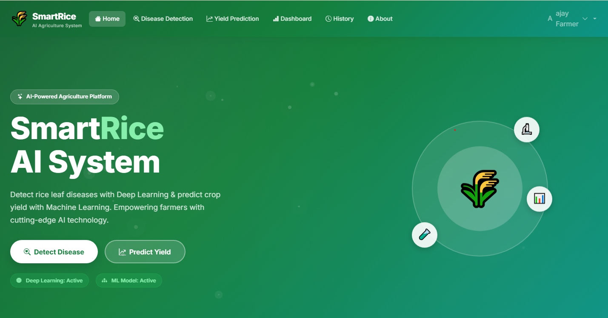

# 🌾 SmartRice: AI-Powered Agriculture Platform

[](https://www.python.org/)
[](https://flask.palletsprojects.com/)
[](https://www.tensorflow.org/)
[](https://render.com/)

**SmartRice** is a state-of-the-art agricultural intelligence system designed to empower farmers and researchers. It combines **Deep Learning** for instant disease diagnosis with **Machine Learning** for accurate yield forecasting, all wrapped in a premium, responsive web interface.

🔗 **Live Demo:** [https://rice-leaf-desease-and-yeild-prediction-1.onrender.com](https://rice-leaf-desease-and-yeild-prediction-1.onrender.com)

---

## ✨ Key Features

### 🔬 1. AI Disease Detection
*   **Instant Diagnosis:** Upload an image of a rice leaf and get results in seconds.
*   **6-Class Classification:** Detects Bacterial Leaf Blight, Blast, Brown Spot, Leaf Smut, Tungro, or identifies the leaf as Healthy.
*   **Treatment Advice:** Receive detailed scientific recommendations and prevention strategies for every detected disease.
*   **Confidence Scores:** Powered by a customized **MobileNetV2** architecture.

### 📈 2. Smart Yield Prediction
*   **Multi-Factor Analysis:** Predicts yield based on rainfall, temperature, soil pH, fertilizer usage, and region.
*   **High Precision:** Utilizes a **Random Forest** Regressor trained on over 12,000 agronomic data points.
*   **Localized Insights:** Supports various rice varieties and regional environmental factors.

### 📊 3. Analytics Dashboard
*   **Visual Reports:** Track your prediction history with dynamic charts and graphs.
*   **User History:** Securely save all your past scans and predictions to your profile.
*   **Statistics:** Real-time summary of total scans and community usage.

### 🔐 4. Secure Authentication
*   **Session Management:** Full Login and Signup system.
*   **Privacy First:** All data is protected and linked to your private account.
*   **Profile Management:** Custom profiles with "Joined Date" and farming statistics.

---

## 🛠️ Technology Stack

| Component | Technology |
| :--- | :--- |
| **Backend** | Python / Flask |
| **Deep Learning** | TensorFlow / Keras (MobileNetV2) |
| **Machine Learning** | Scikit-Learn (Random Forest) |
| **Database** | SQLite3 |
| **Frontend** | HTML5 / CSS3 / JavaScript |
| **Styling** | Vanilla CSS (Glassmorphism) / Bootstrap 5 |
| **Visualizations** | Chart.js |
| **Deployment** | Gunicorn / Render |

---

## 📸 Screenshots

| Home Page | Disease Detection |
| :---: | :---: |
|  |  |

| Yield Prediction | Dashboard Analytics |
| :---: | :---: |
|  |  |

---

## 🚀 Local Installation

Get the project running on your local machine in minutes:

### 1. Clone the Repository
```bash
git clone https://github.com/shanmukh1510/rice_leaf_desease_and_yeild_prediction.git
cd rice_leaf_desease_and_yeild_prediction
```

### 2. Set Up Virtual Environment
```bash
python -m venv venv
# Windows:
venv\Scripts\activate
# Linux/Mac:
source venv/bin/activate
```

### 3. Install Dependencies
```bash
pip install -r requirements.txt
```

### 4. Run the Application
```bash
python app.py
```
Visit `http://127.0.0.1:5000` in your browser.

---

## ☁️ Deployment (Render.com)

To deploy this project to Render:

1.  **Build Command:** 
    `python -m pip install --upgrade pip setuptools wheel && pip install -r requirements.txt`
2.  **Start Command:** 
    `gunicorn app:app`
3.  **Environment Variables:**
    *   `PYTHON_VERSION`: `3.10.12`
4.  **Runtime:** Use `runtime.txt` provided in the repo to pin the Python version.

---

## 🧠 Model Information

*   **Disease Model:** A fine-tuned **MobileNetV2** (Transfer Learning) with custom dense layers for agricultural specificity. It achieves high accuracy on the Rice Leaf Disease Dataset.
*   **Yield Model:** A **Random Forest Regressor** optimized using GridSearch. Key features include environmental metrics (Rainfall, Temp) and agricultural inputs (Fertilizer, pH).

---

## 🤝 Contributing

Contributions are welcome! If you have ideas for improving the models or the UI, please fork the repo and create a pull request.

1.  Fork the Project
2.  Create your Feature Branch (`git checkout -b feature/AmazingFeature`)
3.  Commit your Changes (`git commit -m 'Add some AmazingFeature'`)
4.  Push to the Branch (`git push origin feature/AmazingFeature`)
5.  Open a Pull Request

---

## 📝 License

Distributed under the MIT License. See `LICENSE` for more information.

Developed with ❤️ for Sustainable Agriculture.
